# Evidence - GitOps Canary Auto-Abort Challenge

## 1. Muc tieu

Bai lab chung minh mot luong GitOps hoan chinh de dua ban moi cua service `api` ra an toan:

- Dung Kubernetes local bang Minikube.
- Cai Argo CD de sync manifest tu Git vao cluster.
- Cai Argo Rollouts de deploy `api` bang canary.
- Cai Prometheus/Grafana bang `kube-prometheus-stack` de thu thap metric.
- Cau hinh Alertmanager gui email ca nhan khi SLO bi vi pham.
- Dung `AnalysisTemplate` de Argo Rollouts tu dong danh gia canary.
- Neu ban moi tot thi rollout len 100%.
- Neu ban moi loi thi rollout tu dong fail/abort, giu ban stable cu.
- Rollback dung cach bang `git revert`, khong sua tay tren cluster.

Tieu chi dat:

| Yeu cau                  | Ket qua mong doi                                    |
| ------------------------ | --------------------------------------------------- |
| Thay doi qua Git         | Tat ca manifest nam trong repo va duoc Argo CD sync |
| Argo CD Synced, no drift | Cac Application o trang thai `Synced/Healthy`       |
| 1 SLO + 1 alert          | `ApiSuccessRateTooLow` fire khi API loi             |
| Email ca nhan            | Alertmanager gui mail khi alert match route         |
| Canary auto-abort        | Ban loi khong duoc promote len 100%                 |
| Rollback < 5 phut        | `git revert` va Argo CD sync lai ban cu             |

## 2. Kien truc tong the

```text
Developer
  |
  | git commit + git push
  v
Git repository
  |
  | Argo CD watches repo
  v
Kubernetes cluster
  |
  +-- Argo CD sync Application
  +-- Argo Rollouts dieu khien canary cua api
  +-- Prometheus scrape /metrics qua ServiceMonitor
  +-- PrometheusRule tinh SLO va fire alert
  +-- Alertmanager route alert ve email ca nhan
```

Luong release `api`:

```text
Sua k8s-api/api.yaml trong Git
-> push len remote repo
-> Argo CD sync vao cluster
-> Argo Rollouts tao ReplicaSet moi
-> Canary 25%
-> AnalysisTemplate query Prometheus
-> pass thi tiep tuc 50%, 100%
-> fail thi AnalysisRun Failed va Rollout khong promote ban loi
-> PrometheusRule fire alert neu success rate < 95%
-> Alertmanager gui email
```

## 3. Cau truc repo su dung trong bai

```text
gitops/
|-- app/
|   |-- app.py
|   `-- Dockerfile
|-- argocd/
|   |-- root.yaml
|   `-- apps/
|       |-- api.yaml
|       |-- api-observability.yaml
|       |-- argo-rollouts.yaml
|       |-- kube-prometheus-stack.yaml
|       `-- web.yaml
|-- k8s/
|   |-- namespace.yaml
|   `-- web.yaml
|-- k8s-api/
|   |-- api.yaml
|   |-- analysis-template.yaml
|   `-- serviceemonitor.yaml
|-- monitoring/
|   |-- alertmanager-email.yaml
|   |-- api-slo-alert.yaml
|   `-- test-email-alert.yaml
`-- evidence/
    |-- evidence.md
    `-- image/
```

Y nghia cac file quan trong:

| File                                     | Vai tro                                               |
| ---------------------------------------- | ----------------------------------------------------- |
| `argocd/root.yaml`                       | Root Application theo doi thu muc `argocd/apps`       |
| `argocd/apps/kube-prometheus-stack.yaml` | Cai Prometheus, Grafana, Alertmanager bang Helm chart |
| `argocd/apps/argo-rollouts.yaml`         | Cai Argo Rollouts controller                          |
| `argocd/apps/api.yaml`                   | Argo CD Application sync thu muc `k8s-api`            |
| `argocd/apps/api-observability.yaml`     | Argo CD Application sync thu muc `monitoring`         |
| `k8s-api/api.yaml`                       | Rollout + Service cua API                             |
| `k8s-api/serviceemonitor.yaml`           | Prometheus scrape API `/metrics`                      |
| `k8s-api/analysis-template.yaml`         | Argo Rollouts query Prometheus de auto-check canary   |
| `monitoring/api-slo-alert.yaml`          | Recording rule va alert SLO                           |
| `monitoring/alertmanager-email.yaml`     | Route alert ve email ca nhan                          |

## 4. Cai Kubernetes local bang Minikube

### 4.1. Dieu kien truoc khi cai

May can co cac cong cu:

```powershell
docker --version
kubectl version --client
minikube version
git --version
```

Neu dung Windows, nen chay bang PowerShell hoac Git Bash. Docker Desktop can dang running.

### 4.2. Tao cluster Minikube

```powershell
minikube start -p w9 --driver=docker
```

Giai thich:

- `-p w9`: dat profile la `w9` de tach cluster lab nay voi cluster khac.
- `--driver=docker`: chay Kubernetes node trong Docker.

Kiem tra cluster:

```powershell
kubectl config use-context w9
kubectl get nodes
kubectl get ns
```

Ket qua mong doi:

```text
NAME       STATUS   ROLES           VERSION
minikube   Ready    control-plane    v1.x.x
```

Evidence:

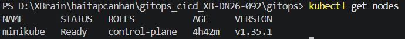

### 4.3. Tao namespace ung dung

Namespace `demo` duoc quan ly bang Git trong `k8s/namespace.yaml`. Neu can tao nhanh de test ban dau:

```powershell
kubectl create namespace demo
```

Trong luong GitOps hoan chinh, namespace nen nam trong Git va duoc Argo CD sync.

## 5. Cai Argo CD

### 5.1. Tao namespace Argo CD

```powershell
kubectl create namespace argocd
```

### 5.2. Cai Argo CD manifests

```powershell
kubectl apply --server-side -n argocd -f https://raw.githubusercontent.com/argoproj/argo-cd/stable/manifests/install.yaml
```

Giai thich:

- Argo CD co nhieu CRD lon.
- `--server-side` giup tranh loi annotation qua dai khi apply CRD.

### 5.3. Doi Argo CD san sang

```powershell
kubectl -n argocd rollout status deploy/argocd-server
kubectl -n argocd get pods
```

Ket qua mong doi:

```text
argocd-application-controller   Running
argocd-server                   Running
argocd-repo-server              Running
argocd-redis                    Running
```

Evidence:

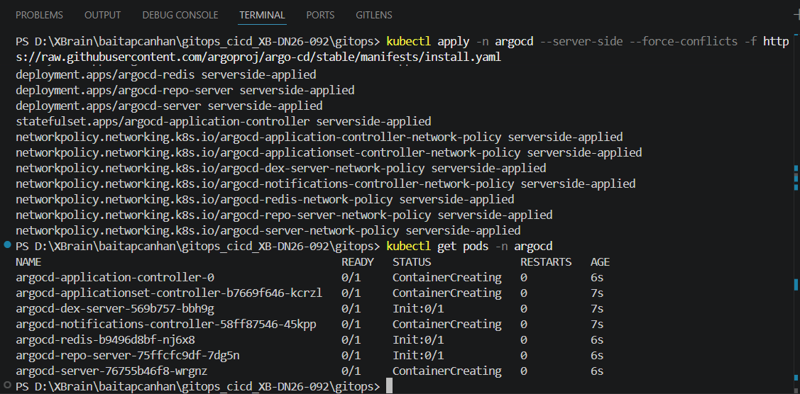

### 5.4. Mo Argo CD UI

```powershell
kubectl -n argocd port-forward svc/argocd-server 8080:443
```

Mo trinh duyet:

```text
https://localhost:8080
```

Lay password mac dinh tren PowerShell:

```powershell
$pwd = kubectl -n argocd get secret argocd-initial-admin-secret -o jsonpath="{.data.password}"
[Text.Encoding]::UTF8.GetString([Convert]::FromBase64String($pwd))
```

Dang nhap:

```text
username: admin
password: <password vua decode>
```

Evidence:

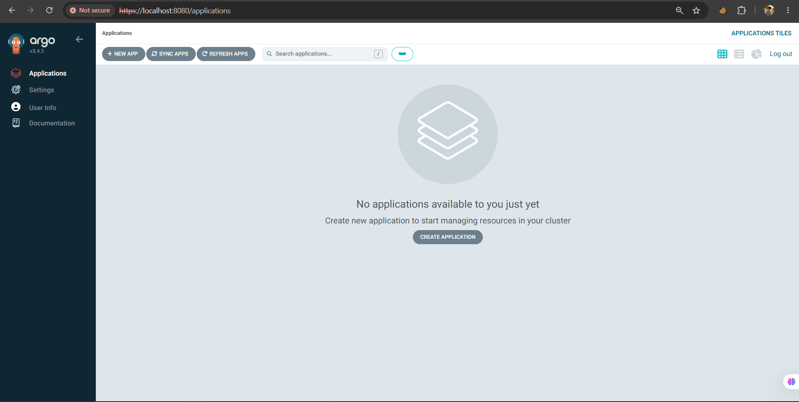

## 6. Cai GitOps root Application

Root Application la diem khoi dau cua mo hinh app-of-apps. Sau khi root ton tai, moi Application con trong `argocd/apps` se duoc Argo CD tao va sync tu Git.

### 6.1. Kiem tra root manifest

File `argocd/root.yaml`:

```yaml
apiVersion: argoproj.io/v1alpha1
kind: Application
metadata:
  name: root
  namespace: argocd
spec:
  project: default
  source:
    repoURL: https://github.com/tuanpm2003/gitops.git
    path: argocd/apps
  destination:
    server: https://kubernetes.default.svc
    namespace: argocd
  syncPolicy:
    automated:
      prune: true
      selfHeal: true
```

Giai thich:

- `source.path: argocd/apps`: root theo doi cac Application con.
- `prune: true`: xoa resource neu da bi xoa khoi Git.
- `selfHeal: true`: neu live state bi sua tay, Argo CD keo ve dung Git.

### 6.2. Apply root lan dau

Lan dau tien can apply root bang tay:

```powershell
kubectl apply -f argocd/root.yaml
```

Sau do cac app con se duoc root tao tu Git.

Kiem tra:

```powershell
kubectl -n argocd get applications
```

Ket qua mong doi:

```text
root                    Synced   Healthy
web                     Synced   Healthy
api                     Synced   Healthy
api-observability       Synced   Healthy
kube-prometheus-stack   Synced   Healthy
argo-rollouts           Synced   Healthy
```

Evidence:

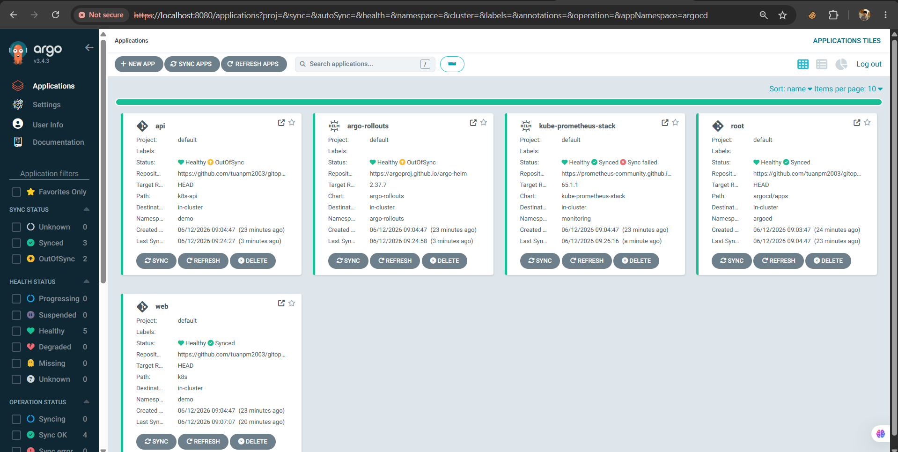

## 7. Cai Argo Rollouts

Argo Rollouts duoc cai qua Argo CD Application `argocd/apps/argo-rollouts.yaml`.

### 7.1. Kiem tra Application

```powershell
kubectl -n argocd get app argo-rollouts
```

Ket qua mong doi:

```text
argo-rollouts   Synced   Healthy
```

### 7.2. Kiem tra controller

```powershell
kubectl -n argo-rollouts get pods
kubectl get crd | Select-String rollouts
```

Ket qua mong doi:

```text
argo-rollouts-...   Running
rollouts.argoproj.io
analysisruns.argoproj.io
analysistemplates.argoproj.io
```

### 7.3. Cai kubectl plugin cho Argo Rollouts

Windows PowerShell:

```powershell
$version = "v1.7.2"
$url = "https://github.com/argoproj/argo-rollouts/releases/download/$version/kubectl-argo-rollouts-windows-amd64"
Invoke-WebRequest -Uri $url -OutFile kubectl-argo-rollouts.exe
mkdir C:\kubectl-plugins
Move-Item .\kubectl-argo-rollouts.exe C:\kubectl-plugins\
```

Them `C:\kubectl-plugins` vao `PATH`, mo terminal moi va kiem tra:

```powershell
kubectl argo rollouts version
```

Dung plugin de theo doi rollout:

```powershell
kubectl argo rollouts -n demo get rollout api --watch
```

Evidence:

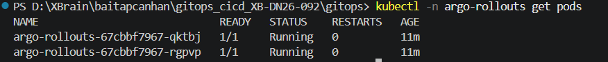

## 8. Cai Prometheus, Grafana, Alertmanager

Prometheus stack duoc cai bang Helm chart `kube-prometheus-stack` thong qua Argo CD Application `argocd/apps/kube-prometheus-stack.yaml`.

### 8.1. Kiem tra Application

```powershell
kubectl -n argocd get app kube-prometheus-stack
```

Ket qua mong doi:

```text
kube-prometheus-stack   Synced   Healthy
```

### 8.2. Kiem tra pod monitoring

```powershell
kubectl -n monitoring get pods
kubectl -n monitoring get svc
```

Ket qua mong doi:

```text
prometheus-kube-prometheus-stack-prometheus-0       Running
alertmanager-kube-prometheus-stack-alertmanager-0   Running
kube-prometheus-stack-grafana-...                   Running
kube-prometheus-stack-operator-...                  Running
```

### 8.3. Kiem tra Prometheus selector

Trong `argocd/apps/kube-prometheus-stack.yaml`, can bat cac cau hinh selector de Prometheus co the doc `ServiceMonitor` va `PrometheusRule` tu nhieu namespace:

```yaml
prometheus:
  prometheusSpec:
    serviceMonitorSelectorNilUsesHelmValues: false
    serviceMonitorNamespaceSelectorNilUsesHelmValues: false
    ruleSelectorNilUsesHelmValues: false
    ruleNamespaceSelectorNilUsesHelmValues: false
```

Kiem tra Prometheus CR thuc te:

```powershell
kubectl -n monitoring get prometheus kube-prometheus-stack-prometheus -o yaml
```

Can thay:

```yaml
ruleSelector: {}
ruleNamespaceSelector: {}
serviceMonitorSelector: {}
serviceMonitorNamespaceSelector: {}
```

Giai thich:

- `ServiceMonitor` cua API nam o namespace `demo`.
- `PrometheusRule` cua SLO nam o namespace `monitoring`.
- Neu selector qua hep, Prometheus se khong scrape API hoac khong load rule.

### 8.4. Mo Prometheus UI

```powershell
kubectl -n monitoring port-forward svc/kube-prometheus-stack-prometheus 9090:9090
```

Mo:

```text
http://localhost:9090
```

Kiem tra target:

```text
Status -> Targets -> tim serviceMonitor/demo/api/0
```

Evidence:

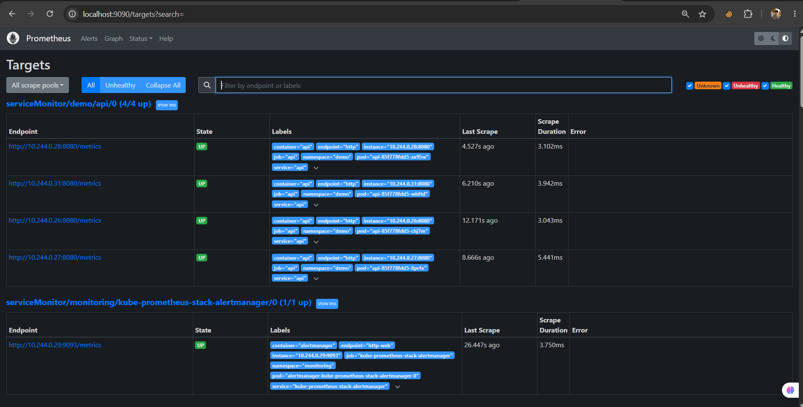

## 9. Build va load image API vao Minikube

API la Flask app trong thu muc `app/`.

### 9.1. Build image

```powershell
docker build -t w9-api:1 app/
```

Kiem tra image local:

```powershell
docker images | Select-String w9-api
```

### 9.2. Load image vao Minikube

```powershell
minikube image load w9-api:1 -p w9
```

Kiem tra image trong Minikube:

```powershell
minikube image ls -p w9 | Select-String w9-api
```

Evidence:

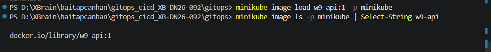

### 9.3. Kiem tra source tao loi

Trong `app/app.py`:

```python
ERR = float(os.getenv("ERROR_RATE", "0"))
VER = os.getenv("VERSION", "v1")

@app.get("/")
def index():
    if random.random() < ERR:
        return jsonify(error="injected", version=VER), 500
    return jsonify(ok=True, version=VER)
```

Y nghia:

- `ERROR_RATE=0`: khong inject loi.
- `ERROR_RATE=0.95`: gan 95% request vao `/` tra HTTP 500.
- `VERSION=v6-bad`: de nhan biet ban dang rollout.
- Loi chi xay ra khi co request vao `/`, khong xay ra voi `/healthz` va `/metrics`.

## 10. Deploy API bang Rollout

API duoc sync boi Application `argocd/apps/api.yaml`, tro vao folder `k8s-api`.

### 10.1. Kiem tra Application API

```powershell
kubectl -n argocd get app api
```

Ket qua mong doi:

```text
api   Synced   Healthy
```

### 10.2. Kiem tra Rollout, Service, Pod

```powershell
kubectl -n demo get rollout,pod,svc
kubectl -n demo get rollout api -o yaml
```

Ket qua mong doi:

```text
rollout.argoproj.io/api
service/api
pod/api-...
```

### 10.3. Kiem tra API tra response

Dung pod tam de curl API noi bo:

```powershell
kubectl -n demo run curl-api --rm -it --image=curlimages/curl -- sh
```

Trong shell cua pod:

```sh
curl http://api:8080/
curl http://api:8080/healthz
curl http://api:8080/metrics | head
```

Ket qua mong doi:

- `/` tra JSON co `version`.
- `/healthz` tra `ok`.
- `/metrics` co metric `flask_http_request_total`.

## 11. ServiceMonitor va Prometheus scrape API

File `k8s-api/serviceemonitor.yaml`:

```yaml
apiVersion: monitoring.coreos.com/v1
kind: ServiceMonitor
metadata:
  name: api
  namespace: demo
  labels:
    app: api
spec:
  selector:
    matchLabels:
      app: api
  endpoints:
    - port: http
      path: /metrics
      interval: 15s
```

Dieu kien de scrape dung:

| Thanh phan                   | Can khop               |
| ---------------------------- | ---------------------- |
| Service label                | `app: api`             |
| ServiceMonitor selector      | `matchLabels.app: api` |
| Service port name            | `http`                 |
| ServiceMonitor endpoint port | `http`                 |
| Metrics path                 | `/metrics`             |

Kiem tra:

```powershell
kubectl -n demo get servicemonitor api -o yaml
kubectl -n demo get svc api -o yaml
```

Query tren Prometheus:

```promql
up{namespace="demo"}
flask_http_request_total{namespace="demo"}
sum(rate(flask_http_request_total{namespace="demo"}[1m]))
```

Neu khong co metric, can kiem tra:

- Pod API co Running khong.
- Service co endpoint khong: `kubectl -n demo get endpoints api`.
- Port Service co ten `http` khong.
- ServiceMonitor co dung namespace va selector khong.
- Prometheus selector co doc ServiceMonitor cross-namespace khong.

## 12. SLO va alert trong Prometheus

SLO duoc chon:

```text
API success rate >= 95%
```

File `monitoring/api-slo-alert.yaml` tao recording rule:

```promql
sum(rate(flask_http_request_total{namespace="demo",status!~"5.."}[1m]))
/
sum(rate(flask_http_request_total{namespace="demo"}[1m]))
```

Giai thich query:

| Thanh phan                 | Y nghia                                   |
| -------------------------- | ----------------------------------------- |
| `flask_http_request_total` | Tong request Flask ghi nhan               |
| `rate(...[1m])`            | Toc do request trong 1 phut gan nhat      |
| `status!~"5.."`            | Chi lay request khong phai loi server 5xx |
| Tu so / mau so             | Ty le request thanh cong                  |
| `< 0.95`                   | Vi pham SLO 95%                           |

Alert:

```promql
api:http_success_rate:1m < 0.95
```

Label quan trong:

```yaml
labels:
  severity: critical
  slo: api-success-rate
  namespace: monitoring
```

Giai thich label `namespace: monitoring`:

- `AlertmanagerConfig` cua Prometheus Operator tu them matcher theo namespace.
- Route email chi match alert co `namespace="monitoring"`.
- Neu alert khong co label nay, Alertmanager co the dua alert vao receiver `null` va khong gui email.

Kiem tra rule da duoc tao:

```powershell
kubectl -n monitoring get prometheusrule api-slo-alert
kubectl -n monitoring describe prometheusrule api-slo-alert
```

Kiem tra Prometheus da load rule:

```powershell
kubectl -n monitoring exec prometheus-kube-prometheus-stack-prometheus-0 -c prometheus -- wget -qO- http://localhost:9090/api/v1/rules
```

Query tren Prometheus UI:

```promql
api:http_success_rate:1m
ALERTS{alertname="ApiSuccessRateTooLow"}
ALERTS{alertname="ApiSuccessRateTooLow",alertstate="firing"}
```

Evidence:

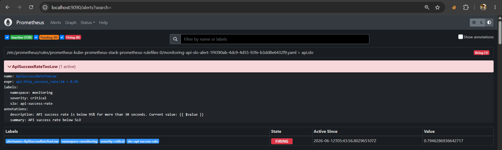

## 13. Cau hinh Alertmanager gui email

### 13.1. Tao Secret SMTP

Alertmanager can Gmail App Password. Khong nen commit password vao Git.

Tao secret truc tiep trong cluster:

```powershell
kubectl -n monitoring create secret generic alertmanager-smtp-secret --from-literal=smtp_password="<GMAIL_APP_PASSWORD>"
```

Kiem tra secret:

```powershell
kubectl -n monitoring get secret alertmanager-smtp-secret
kubectl -n monitoring get secret alertmanager-smtp-secret -o jsonpath="{.data.smtp_password}"
```

Luu y:

- Neu app password da bi lo, can revoke va tao password moi.
- Khong dua app password vao README/evidence.
- Neu muon GitOps hoa secret, nen dung SealedSecret, ExternalSecret hoac SOPS.

### 13.2. AlertmanagerConfig

File `monitoring/alertmanager-email.yaml`:

```yaml
apiVersion: monitoring.coreos.com/v1alpha1
kind: AlertmanagerConfig
metadata:
  name: api-email-alert
  namespace: monitoring
  labels:
    alertmanagerConfig: api-email-alert
spec:
  route:
    receiver: email-personal
    groupBy:
      - alertname
      - severity
    groupWait: 10s
    groupInterval: 30s
    repeatInterval: 5m
  receivers:
    - name: email-personal
      emailConfigs:
        - to: minhtuan.phan282@gmail.com
          from: minhtuan.phan282@gmail.com
          smarthost: smtp.gmail.com:587
          authUsername: minhtuan.phan282@gmail.com
          authPassword:
            name: alertmanager-smtp-secret
            key: smtp_password
          requireTLS: true
          sendResolved: true
```

### 13.3. Kiem tra AlertmanagerConfig duoc chon

Trong `argocd/apps/kube-prometheus-stack.yaml`, Alertmanager chon config bang label:

```yaml
alertmanager:
  alertmanagerSpec:
    alertmanagerConfigSelector:
      matchLabels:
        alertmanagerConfig: api-email-alert
```

Kiem tra Alertmanager CR:

```powershell
kubectl -n monitoring get alertmanager kube-prometheus-stack-alertmanager -o yaml
```

Can thay:

```yaml
alertmanagerConfigSelector:
  matchLabels:
    alertmanagerConfig: api-email-alert
```

### 13.4. Kiem tra runtime config cua Alertmanager

```powershell
kubectl -n monitoring exec alertmanager-kube-prometheus-stack-alertmanager-0 -c alertmanager -- wget -qO- http://localhost:9093/api/v2/status
```

Can thay receiver email:

```text
monitoring/api-email-alert/email-personal
```

Va email config:

```text
smarthost: smtp.gmail.com:587
to: minhtuan.phan282@gmail.com
auth_password: <secret>
```

### 13.5. Kiem tra Alertmanager nhan alert

```powershell
kubectl -n monitoring exec alertmanager-kube-prometheus-stack-alertmanager-0 -c alertmanager -- wget -qO- http://localhost:9093/api/v2/alerts
```

Neu alert match email route, phan `receivers` se co:

```text
monitoring/api-email-alert/email-personal
```

Neu thay receiver la `null`, nghia la alert chua match route email.

## 14. Test gui email bang alert gia lap

Dung `test-email-alert.yaml` de test rieng duong gui email, khong phu thuoc API.

Manifest:

```yaml
apiVersion: monitoring.coreos.com/v1
kind: PrometheusRule
metadata:
  name: test-email-alert
  namespace: monitoring
spec:
  groups:
    - name: test.email
      rules:
        - alert: TestEmailAlert
          expr: vector(1)
          for: 0s
          labels:
            severity: critical
            namespace: monitoring
          annotations:
            summary: "Test email alert"
            description: "This is a test alert from Prometheus."
```

Giai thich:

- `vector(1)` luon tra ve gia tri 1.
- Vi vay alert luon firing.
- Label `namespace: monitoring` giup alert match route cua `AlertmanagerConfig`.
- Neu email test gui duoc, Prometheus -> Alertmanager -> SMTP da hoat dong.

Apply test alert:

```powershell
kubectl apply -f monitoring/test-email-alert.yaml
```

Kiem tra Prometheus:

```promql
ALERTS{alertname="TestEmailAlert"}
```

Kiem tra Alertmanager:

```powershell
kubectl -n monitoring exec alertmanager-kube-prometheus-stack-alertmanager-0 -c alertmanager -- wget -qO- http://localhost:9093/api/v2/alerts
```

Ket qua mong doi:

```text
TestEmailAlert active
receiver: monitoring/api-email-alert/email-personal
```

Evidence:

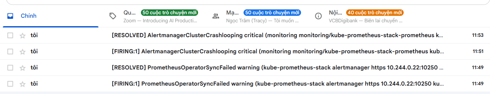

Neu khong nhan email:

```powershell
kubectl -n monitoring logs alertmanager-kube-prometheus-stack-alertmanager-0 -c alertmanager --tail=100
kubectl -n monitoring logs deploy/kube-prometheus-stack-operator --tail=100
```

Cac loi thuong gap:

| Hien tuong                      | Nguyen nhan                | Cach sua                                                     |
| ------------------------------- | -------------------------- | ------------------------------------------------------------ |
| Receiver la `null`              | Alert khong match route    | Them label `namespace: monitoring` hoac sua matcher strategy |
| Alertmanager reconcile fail     | Config sai receiver/secret | Xem log operator                                             |
| SMTP auth fail                  | Sai Gmail App Password     | Tao lai app password                                         |
| Khong co alert trong Prometheus | Rule chua duoc load        | Kiem tra PrometheusRule selector                             |

## 15. Test alert SLO that cua API

### 15.1. Inject loi trong API

Sua `k8s-api/api.yaml` qua Git:

```yaml
env:
  - name: ERROR_RATE
    value: "0.95"
  - name: VERSION
    value: "v6-bad"
```

Commit va push:

```powershell
git add k8s-api/api.yaml
git commit -m "release api v6 bad"
git push
```

Argo CD se sync thay doi va Argo Rollouts tao canary ReplicaSet moi.

### 15.2. Tao traffic vao endpoint bi loi

Quan trong: `ERROR_RATE` chi anh huong endpoint `/`. Neu chi co `/healthz` va `/metrics`, alert co the khong fire.

Tao load:

```powershell
kubectl -n demo run api-load --rm -it --image=curlimages/curl -- sh -c "while true; do curl -s -o /dev/null http://api:8080/; sleep 0.2; done"
```

### 15.3. Kiem tra metric va alert

Prometheus query:

```promql
flask_http_request_total{namespace="demo"}
api:http_success_rate:1m
ALERTS{alertname="ApiSuccessRateTooLow"}
ALERTS{alertname="ApiSuccessRateTooLow",alertstate="firing"}
```

Ket qua mong doi:

```text
api:http_success_rate:1m < 0.95
ApiSuccessRateTooLow firing
```

Kiem tra Alertmanager route:

```powershell
kubectl -n monitoring exec alertmanager-kube-prometheus-stack-alertmanager-0 -c alertmanager -- wget -qO- http://localhost:9093/api/v2/alerts
```

Ket qua mong doi:

```text
ApiSuccessRateTooLow active
receiver: monitoring/api-email-alert/email-personal
```

## 16. Canary auto-abort bang AnalysisTemplate

### 16.1. Rollout strategy

Trong `k8s-api/api.yaml`:

```yaml
strategy:
  canary:
    steps:
      - setWeight: 25
      - pause:
          duration: 90s
      - analysis:
          templates:
            - templateName: api-success-rate
      - setWeight: 50
      - pause:
          duration: 60s
      - analysis:
          templates:
            - templateName: api-success-rate
      - setWeight: 100
```

Giai thich:

- Dau tien dua 25% traffic sang ban moi.
- Cho 90s de Prometheus co du du lieu.
- Chay analysis `api-success-rate`.
- Neu pass, tiep tuc len 50%.
- Neu fail, Rollout dung lai va khong promote ban moi.

### 16.2. AnalysisTemplate

Trong `k8s-api/analysis-template.yaml`:

```yaml
successCondition: result[0] >= 0.95
failureCondition: result[0] < 0.95
failureLimit: 1
provider:
  prometheus:
    address: http://kube-prometheus-stack-prometheus.monitoring.svc:9090
    query: |
      sum(rate(flask_http_request_total{namespace="demo",status!~"5.."}[1m]))
      /
      sum(rate(flask_http_request_total{namespace="demo"}[1m]))
```

Y nghia:

| Dieu kien           | Ket qua                                     |
| ------------------- | ------------------------------------------- |
| `result[0] >= 0.95` | Canary duoc xem la tot                      |
| `result[0] < 0.95`  | Canary bi fail                              |
| `failureLimit: 1`   | Chi can vuot nguong fail la Rollout bi chan |

### 16.3. Theo doi rollout khi release ban loi

```powershell
kubectl argo rollouts -n demo get rollout api --watch
```

Kiem tra AnalysisRun:

```powershell
kubectl -n demo get analysisrun
kubectl -n demo describe analysisrun <analysisrun-name>
```

Ket qua mong doi voi ban loi:

```text
AnalysisRun: Failed
Metric api-success-rate: Failed
Rollout: Degraded / Aborted
CanaryReplicaSet: khong duoc promote len 100%
StableReplicaSet: van giu ban cu
```

Evidence:

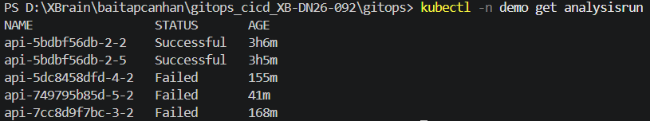

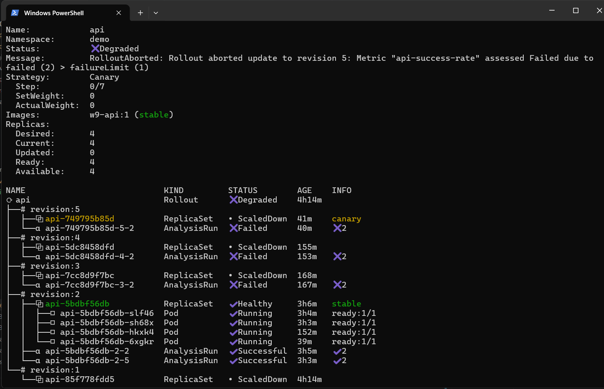

### 16.4. Test case ban tot

Sua Git:

```yaml
- name: ERROR_RATE
  value: "0"
- name: VERSION
  value: "v-good"
```

Commit va push:

```powershell
git add k8s-api/api.yaml
git commit -m "release api healthy"
git push
```

Theo doi:

```powershell
kubectl argo rollouts -n demo get rollout api --watch
```

Ket qua mong doi:

```text
AnalysisRun: Successful
Rollout: Healthy
Canary promoted to 100%
```

### 16.5. Test case ban loi

Sua Git:

```yaml
- name: ERROR_RATE
  value: "0.95"
- name: VERSION
  value: "v-bad"
```

Commit va push:

```powershell
git add k8s-api/api.yaml
git commit -m "release api bad"
git push
```

Chay load vao `/`:

```powershell
kubectl -n demo run api-load --rm -it --image=curlimages/curl -- sh -c "while true; do curl -s -o /dev/null http://api:8080/; sleep 0.2; done"
```

Ket qua mong doi:

```text
AnalysisRun failed
Rollout khong len 100%
Alert ApiSuccessRateTooLow firing
Email duoc gui
```

## 17. Rollback bang Git revert

Trong GitOps, khong rollback bang:

```powershell
kubectl rollout undo
kubectl edit
kubectl patch
```

Ly do: nhung lenh nay chi sua live state. Git van giu ban loi, nen Argo CD co the sync lai ban loi.

Rollback dung:

```powershell
git log --oneline
git revert <commit-release-loi>
git push
```

Hoac revert commit moi nhat:

```powershell
git revert HEAD --no-edit
git push
```

Kiem tra Argo CD sync lai:

```powershell
kubectl -n argocd get applications
kubectl argo rollouts -n demo get rollout api
kubectl -n demo get pods -l app=api
```

Ket qua mong doi:

```text
Application api: Synced/Healthy
Rollout api: Healthy
VERSION quay ve ban tot
Thoi gian rollback < 5 phut
```

## 18. Checklist kiem chung cuoi cung

### 18.1. Kubernetes

```powershell
kubectl get nodes
kubectl get ns
```

Can thay node `Ready`, namespace `argocd`, `monitoring`, `argo-rollouts`, `demo`.

### 18.2. Argo CD

```powershell
kubectl -n argocd get pods
kubectl -n argocd get applications
```

Can thay cac app `Synced/Healthy`.

### 18.3. Argo Rollouts

```powershell
kubectl -n argo-rollouts get pods
kubectl get crd | Select-String rollouts
kubectl argo rollouts -n demo get rollout api
```

Can thay controller Running va Rollout `api` ton tai.

### 18.4. Prometheus

```powershell
kubectl -n monitoring get pods
kubectl -n demo get servicemonitor api
kubectl -n monitoring get prometheusrule api-slo-alert
```

Prometheus UI query:

```promql
up{namespace="demo"}
flask_http_request_total{namespace="demo"}
api:http_success_rate:1m
```

### 18.5. Alertmanager

```powershell
kubectl -n monitoring get alertmanagerconfig api-email-alert
kubectl -n monitoring get secret alertmanager-smtp-secret
kubectl -n monitoring exec alertmanager-kube-prometheus-stack-alertmanager-0 -c alertmanager -- wget -qO- http://localhost:9093/api/v2/status
```

Can thay receiver email `monitoring/api-email-alert/email-personal`.

### 18.6. Email

```promql
ALERTS{alertname="TestEmailAlert"}
ALERTS{alertname="ApiSuccessRateTooLow"}
```

Can thay alert active/firing va email trong inbox.

## 19. Cac loi da gap va cach xu ly

| Loi                                 | Dau hieu                              | Nguyen nhan                                  | Cach xu ly                                   |
| ----------------------------------- | ------------------------------------- | -------------------------------------------- | -------------------------------------------- |
| `TestEmailAlert` khong gui mail     | Alert active nhung receiver `null`    | Thieu label `namespace: monitoring`          | Them label hoac sua matcher strategy         |
| `ApiSuccessRateTooLow` khong firing | Query `ALERTS` rong                   | Chua co traffic vao `/` hoac metric chua du  | Chay pod load curl vao `http://api:8080/`    |
| Prometheus khong thay API           | Khong co `flask_http_request_total`   | ServiceMonitor/Service label/port khong khop | Kiem tra label `app=api`, port `http`        |
| Alertmanager reconcile fail         | Operator log bao `undefined receiver` | Route receiver sai hoac config cu loi        | Kiem tra status/log va apply lai config dung |
| Gmail khong gui                     | Log SMTP auth fail                    | Sai app password hoac Gmail chan             | Tao Gmail App Password moi                   |
| Rollout khong abort                 | Analysis pass hoac query NaN          | Khong co traffic loi, query khong co du lieu | Tao traffic va doi 1-2 phut                  |

## 20. Ket luan

Bai lab hoan thanh cac diem chinh cua GitOps Canary Auto-Abort Challenge:

- Kubernetes local duoc dung lam moi truong chay lab.
- Argo CD dong vai tro GitOps controller, sync resource tu Git vao cluster.
- Argo Rollouts thay Deployment thuong bang Rollout de ho tro canary.
- Prometheus scrape metric API qua ServiceMonitor.
- SLO `API success rate >= 95%` duoc hien thuc bang PrometheusRule.
- Alertmanager gui email khi SLO bi vi pham.
- AnalysisTemplate giup Rollout tu dong danh gia ban canary.
- Ban tot duoc promote len 100%.
- Ban loi bi chan/abort va khong thay the ban stable.
- Rollback duoc thuc hien bang `git revert`, dung voi GitOps va co the hoan thanh trong duoi 5 phut.
